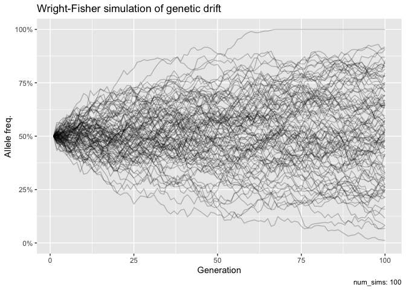
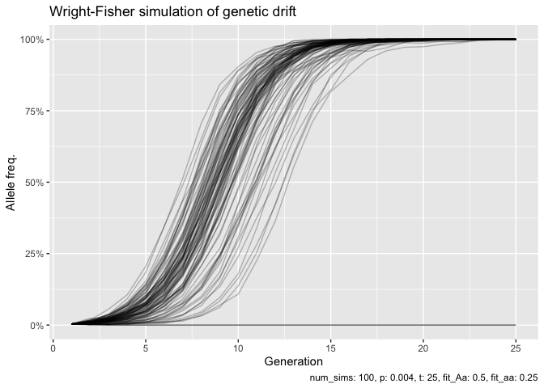

<!-- README.md is generated from README.Rmd. Please edit that file -->

# whisper

Simulate and visualise allele trajectories, using Wright-Fisher
simulation.

## Installation

You can install the development version of whisper from
[GitHub](https://github.com/) with:

``` r
# install.packages("devtools")
devtools::install_github("emilmalta/whisper")
```

Load the contents into R environment using

``` r
library(whisper)
```

## wf_sim()

The `wf_sim` function produves a vector of allele frequencies using WF
simulation. By default, population size is `250`, initial allele
frequency is `0.5`, and `100` generations are produced.

``` r
wf_sim()
#>   [1] 0.500 0.458 0.430 0.440 0.438 0.436 0.424 0.398 0.434 0.418 0.412 0.448
#>  [13] 0.462 0.440 0.416 0.420 0.414 0.416 0.448 0.438 0.458 0.456 0.444 0.450
#>  [25] 0.442 0.450 0.452 0.432 0.448 0.480 0.446 0.452 0.466 0.456 0.454 0.420
#>  [37] 0.440 0.416 0.440 0.420 0.402 0.396 0.456 0.482 0.512 0.514 0.506 0.528
#>  [49] 0.532 0.538 0.546 0.540 0.526 0.526 0.560 0.546 0.540 0.530 0.528 0.522
#>  [61] 0.510 0.512 0.510 0.490 0.484 0.528 0.554 0.552 0.540 0.568 0.522 0.614
#>  [73] 0.626 0.586 0.596 0.574 0.542 0.530 0.520 0.504 0.502 0.532 0.506 0.514
#>  [85] 0.496 0.480 0.468 0.472 0.488 0.508 0.526 0.516 0.504 0.540 0.530 0.580
#>  [97] 0.598 0.626 0.598 0.618
```

No mutation rates or selection by default. Mutation can be simulated
like so:

``` r
wf_sim(p = 1/250, mut_to = .8, mut_from = .1)
#>   [1] 0.004 0.800 0.866 0.878 0.918 0.890 0.908 0.904 0.888 0.872 0.886 0.906
#>  [13] 0.850 0.866 0.898 0.882 0.894 0.924 0.902 0.882 0.904 0.912 0.890 0.894
#>  [25] 0.892 0.864 0.880 0.892 0.894 0.902 0.872 0.884 0.894 0.888 0.880 0.890
#>  [37] 0.886 0.862 0.864 0.886 0.884 0.880 0.884 0.882 0.900 0.886 0.880 0.884
#>  [49] 0.898 0.892 0.916 0.886 0.868 0.866 0.866 0.908 0.904 0.896 0.890 0.886
#>  [61] 0.884 0.876 0.902 0.900 0.900 0.870 0.878 0.896 0.864 0.890 0.888 0.874
#>  [73] 0.874 0.908 0.902 0.888 0.906 0.912 0.892 0.854 0.900 0.914 0.896 0.894
#>  [85] 0.894 0.910 0.896 0.890 0.906 0.898 0.896 0.880 0.882 0.884 0.876 0.876
#>  [97] 0.898 0.900 0.888 0.914
```

Selection assumes a diploid organism, and genotype fitness is provided
for each:

``` r
# Dominant selection for A:
wf_sim(p = 1/250, fit_aa = .5)
#>   [1] 0.004 0.008 0.014 0.036 0.050 0.094 0.172 0.238 0.326 0.438 0.502 0.566
#>  [13] 0.640 0.664 0.654 0.720 0.758 0.774 0.806 0.832 0.832 0.830 0.888 0.890
#>  [25] 0.894 0.884 0.920 0.930 0.926 0.926 0.930 0.942 0.956 0.970 0.966 0.974
#>  [37] 0.964 0.964 0.968 0.956 0.970 0.960 0.962 0.966 0.962 0.960 0.958 0.974
#>  [49] 0.964 0.970 0.972 0.970 0.966 0.966 0.974 0.968 0.968 0.958 0.966 0.956
#>  [61] 0.942 0.948 0.950 0.952 0.948 0.936 0.938 0.940 0.944 0.942 0.928 0.928
#>  [73] 0.920 0.926 0.926 0.930 0.938 0.950 0.950 0.954 0.956 0.962 0.952 0.954
#>  [85] 0.958 0.962 0.972 0.974 0.970 0.980 0.976 0.978 0.980 0.978 0.978 0.978
#>  [97] 0.988 0.990 0.992 0.992

# Additive selection for A:
wf_sim(p = 1/250, fit_Aa = .5, fit_aa = .25)
#>   [1] 0.004 0.014 0.038 0.070 0.160 0.288 0.430 0.584 0.758 0.876 0.926 0.958
#>  [13] 0.980 0.986 0.996 1.000 1.000 1.000 1.000 1.000 1.000 1.000 1.000 1.000
#>  [25] 1.000 1.000 1.000 1.000 1.000 1.000 1.000 1.000 1.000 1.000 1.000 1.000
#>  [37] 1.000 1.000 1.000 1.000 1.000 1.000 1.000 1.000 1.000 1.000 1.000 1.000
#>  [49] 1.000 1.000 1.000 1.000 1.000 1.000 1.000 1.000 1.000 1.000 1.000 1.000
#>  [61] 1.000 1.000 1.000 1.000 1.000 1.000 1.000 1.000 1.000 1.000 1.000 1.000
#>  [73] 1.000 1.000 1.000 1.000 1.000 1.000 1.000 1.000 1.000 1.000 1.000 1.000
#>  [85] 1.000 1.000 1.000 1.000 1.000 1.000 1.000 1.000 1.000 1.000 1.000 1.000
#>  [97] 1.000 1.000 1.000 1.000
```

## wf_plot()

A ggplot of overlaid Wright-Fisher simulations can be made using
`wf_plot()`:

``` r
wf_plot(num_sims = 100)
```



Takes same parameters as the `wf_sim()` function:

``` r
wf_plot(p = 1/250, t = 25, fit_Aa = .5, fit_aa = .25) 
```



## wf_shiny()

Currently not in this version, but there are plans for a shiny app.
